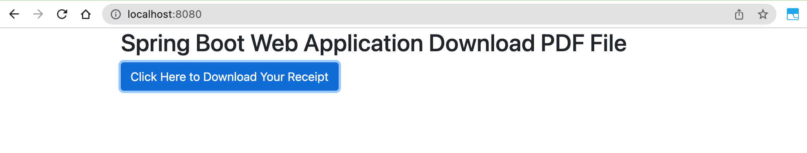

# springboot-download-pdf

### Things to do list

1. Clone this repository: `git clone https://github.com/hendisantika/springboot-download-pdf.git`
2. Navigate to the folder: `cd springboot-download-pdf`
3. Run the application: `mvn clean spring-boot:run`
4. Open your favorite browser: http://localhost:8080

### Image screen shot

Download PDF File

